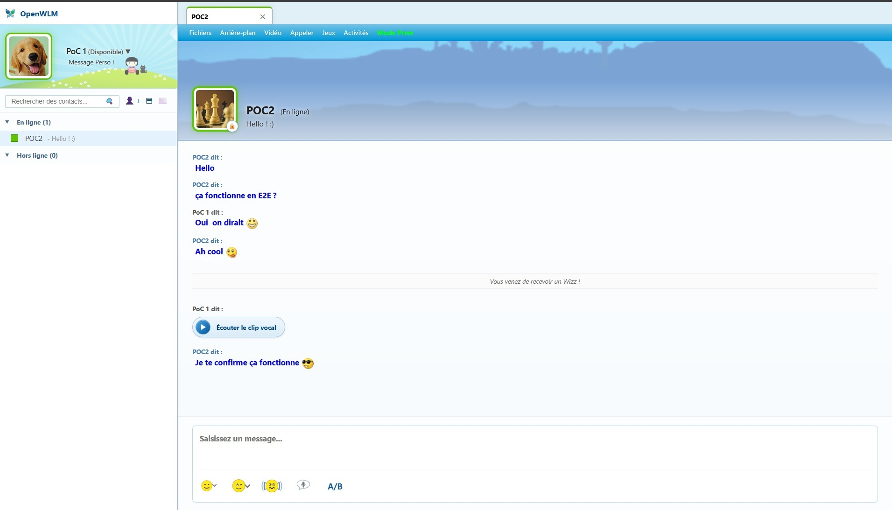
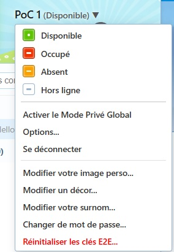

<p align="center">
  
</p>

<p align="center">
  <a href="README.md">English</a> • <b>Français</b>
</p>

# OpenWLM (Modern Web Stack)

Une récréation moderne, open-source et sécurisée de l'expérience iconique de messagerie rétro **Windows Live Messenger 2009 (Wave 3 / Aero)**. Ce projet combine le design nostalgique des années 2000 avec les standards de sécurité, de chiffrement et de performance de 2026.

⚠️ **Avertissement & Notice légale** :  
OpenWLM est un projet éducatif indépendant, open-source et un hommage nostalgique. Il n'est en aucun cas affilié, associé, autorisé ou soutenu par Microsoft Corporation ou l'une de ses filiales.

> [!WARNING]
> **Avertissement sur le développement assisté par IA** :  
> Ce projet a été développé avec l'assistance d'une Intelligence Artificielle (Google Antigravity / programmation en binôme assistée par LLM). Bien que des revues rigoureuses, des tests de bout en bout et un audit d'enforcement de sécurité approfondi (`npm run test:security`) aient été menés, des anomalies, régressions marginales ou comportements imprévus peuvent subsister. Les revues de code, audits communautaires et retours de sécurité sont les bienvenus !

---

## 🚀 Fonctionnalités principales

### 💬 Communication & Expérience WLM
- **Interface Authentique** : Design rétro fidèle à WLM 2009 (Aero glass, onglets, scènes de fond, usertiles, sons d'origine).
- **Application Web Progressive (PWA)** : Totalement installable en tant qu'application autonome sur ordinateur ou mobile avec mise en cache hors-ligne des assets via Service Worker, manifeste web et intégration d'icônes rétro Aero dans la barre des tâches.
- **Assistant de test intégré ("OpenWLM")** : Contact système virtuel (ID `-1`) avec état d'accueil central, permettant de tester immédiatement le chat, les émoticônes, les sons, le Wizz et le Morpion sans second compte.
- **Messagerie Instantanée Sécurisée** : Texte riche, émoticônes classiques d'origine et émoticônes personnalisées E2EE.
- **Audio & Vidéo (WebRTC)** : Appels vocaux et vidéo en direct avec signalisation chiffrée.
- **Messages Vocaux** : Enregistrement et lecture de clips vocaux chiffrés.
- **Winks & Wizz** : Clins d'œil animés et Wizz secouant la fenêtre.
- **Activités & Jeux 1v1** : Morpion (Tic-Tac-Toe) et Jeu de dames (Checkers) en temps réel avec validation autoritaire anti-triche côté serveur.
- **Transfert de fichiers chiffré E2EE** : Partage temporaire (expiration 4h) avec déchiffrement direct et prévisualisation d'images.
- **Internationalisation Complète (FR / EN)** : Support bilingue natif Français et Anglais avec bascule réactive instantanée, détection automatique du navigateur et zéro régression visuelle sur le rendu Aero.

---

## 🔐 Sécurité & Architecture (Security Hardened)

OpenWLM a fait l'objet d'un audit de sécurité approfondi et d'un durcissement rigoureux :

1. **Chiffrement de bout en bout (E2EE Zero-Knowledge)** :
   - Chiffrement asymétrique RSA-OAEP 2048 bits pour l'échange de clés de session.
   - Chiffrement symétrique AES-256-GCM pour les messages, fichiers et émoticônes.
   - Le serveur ne voit jamais le texte en clair ni les clés de déchiffrement (Zero-Knowledge).
2. **Autorisation centralisée (`canInteract`)** :
   - Vérification stricte des relations de contact mutuel et de l'absence de blocage avant toute interaction (messages, wizz, appels, fichiers, jeux).
3. **Prévention de l'usurpation d'identité (Anti-Spoofing)** :
   - Validation stricte de l'identité émettrice via le token JWT certifié.
   - Les pseudonymes affichés sont systématiquement recalculés depuis la base de données SQL côté serveur.
4. **Mode Privé (Off-The-Record) autoritaire** :
   - Forçage côté serveur de la non-persistance si un contact a activé le mode privé global (`global_private = 1`).
5. **Révocation instantanée des sessions JWT (`token_version`)** :
   - Invalidation immédiate des jetons côté serveur lors de la déconnexion (`/api/logout` et `manual_disconnect`) ou du changement de mot de passe.
6. **Protection contre les abus & déni de service** :
   - Quota de stockage strict de **1 Go** par compte utilisateur pour les fichiers partagés.
   - Rate limiting étagé : authentification (10 req/min), uploads (5 req/min), wizz (3/min), winks (7/min), messages (20 / 10s).
   - Nettoyage automatique toutes les 5 minutes des structures mémoire (captchas, adresses IP inactives).
7. **Comparaisons cryptographiques sécurisées** :
   - Vérification des hashs PBKDF2 en temps constant (`crypto.timingSafeEqual`) pour neutraliser les attaques par analyse temporelle.

---

## 🛠 Tech Stack

- **Frontend** : React 19, TypeScript, Vite, CSS Vanilla (thème Aero / WLM).
- **Plateformes Client** : Navigateur web, Progressive Web App (PWA) avec Service Worker & Manifeste Web, Desktop (wrapper Electron optionnel).
- **Backend** : Node.js, Express, Socket.IO.
- **Base de données** : SQLite (via `better-sqlite3`).
- **Cryptographie** : Web Crypto API (`SubtleCrypto`), Node.js `crypto` (PBKDF2 SHA-512, AES-GCM, RSA-OAEP).

---

<p align="center">
  
  
</p>

---

## 📦 Installation & Lancement

### Prérequis
- **Node.js** : v20 ou supérieur recommandé (testé sous v22 LTS).
- **npm** : v10 ou supérieur.

### 1. Cloner le dépôt
```bash
git clone https://github.com/OpenWLM/OpenWLM.git
cd OpenWLM
npm install
```

### 2. Initialiser la base de données de développement (Optionnel)
Pour tester l'application immédiatement avec deux comptes de démonstration pré-configurés :
```bash
npm run db:seed
```
Ce script crée deux comptes fictifs (sans aucune donnée personnelle) :
- `alice@openwlm.local` (Mot de passe: `DemoPassword123!`)
- `bob@openwlm.local` (Mot de passe: `DemoPassword123!`)

> *Note : Si vous ne lancez pas `npm run db:seed`, le serveur créera automatiquement une base vierge au premier démarrage.*

### 3. Démarrer l'application

#### Mode Développement (Frontend Vite + Backend avec rechargement à chaud) :
```bash
npm run dev
```

#### Mode Production :
```bash
# Compiler le frontend React
npm run build

# Démarrer le serveur Node.js en mode production
npm run server
# ou en direct :
NODE_ENV=production node server/index.js
```
L'application est accessible sur : **http://localhost:3001**

---

## 🧪 Tests de Sécurité & Non-Régression

Une suite de tests d'enforcement serveur est intégrée au projet pour valider que toutes les restrictions du frontend sont rigoureusement appliquées côté API et sockets :

```bash
npm test
# ou :
npm run test:security
```

Cette suite simule des contournements directs sans passer par l'interface :
- Usurpation d'identifiant expéditeur (rejet immédiat)
- Espionnage ou suppression de l'historique d'autrui (rejet HTTP 403)
- Forçage de persistance en mode privé (rejeté par le serveur)
- Invitation de soi-même ou doublon d'invitation (rejet HTTP 400)
- Acceptation d'invitation destinée à un tiers (rejet HTTP 404)
- Appel WebRTC ou message vers non-contact ou faux contact (bloqué)
- Triche aux jeux multi-joueurs (coup hors-tour, case déjà occupée)
- Téléchargement de fichiers sans token cryptographique d'accès (rejet HTTP 401/403)
- Injection de chemin (Path Traversal) sur les avatars/scènes (rejet HTTP 400)

---

## 🛡️ Procédure de Sauvegarde avant Évolution Sensible

Pour respecter les bonnes pratiques de maintenance et garantir un retour arrière immédiat :

```bash
# 1. Créer une archive à froid horodatée (serveur arrêté de préférence)
tar czf OpenWLM_backup_$(date +%Y%m%d_%H%M%S).tar.gz --exclude='node_modules' --exclude='.git' .

# 2. Créer un tag Git local avant toute modification
git tag pre-feature-$(date +%Y%m%d)
```

---

## 🏷️ Version & Référence

- **Version actuelle** : `v1.0.0`
- **Tag Git de référence** : `v1.0.0`
- **Historique complet** : Voir le fichier [CHANGELOG.md](CHANGELOG.md).

---

## 📄 Licence

Ce projet est sous licence MIT. Voir le fichier [LICENSE](LICENSE) pour plus d'informations.
