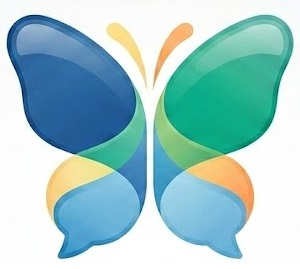

<p align="center">
  
</p>

# OpenWLM (Modern Web Stack)

Une récréation moderne, open-source et sécurisée de l'expérience iconique de Windows Live Messenger 2009. Ce projet combine le design nostalgique des années 2000 avec les standards de sécurité et de performance de 2026.

⚠️ **Disclaimer & Security Notice**: 
OpenWLM is an independent, open-source educational project and a nostalgic tribute. It is not affiliated, associated, authorized, endorsed by, or in any way officially connected with Microsoft Corporation or any of its subsidiaries.

**Please note:** - This project is currently a **Proof of Concept (PoC)** developed for educational purposes. 
- **AI-Assisted Codebase:** Parts of this codebase and its architecture have been generated or assisted by AI (Gemini). While it implements modern cryptographic concepts (E2EE, Zero-Knowledge), the code **has not undergone a professional human security audit and may contain vulnerabilities**. 
- Do not use OpenWLM to exchange highly sensitive data. Use it at your own risk.

---

## 🚀 Fonctionnalités

### 💬 Communication & UI
- **Interface Authentique** : Fidèle au design de WLM 2009 (Boutons, dégradés, scènes, usertiles).
- **Messagerie Instantanée** : Support du texte riche (couleurs, polices), des émoticônes animées d'origine.
- **Audio & Vidéo (WebRTC)** : Appels vocaux et vidéo fluides avec signalisation via WebSockets + STUN (Beta)
- **Messages Vocaux** : Enregistrement et lecture de clips vocaux chiffrés.
- **Winks & Nudges** : Les animations et Wizzs originaux.
- **Gestion des Contacts** : Ajout, blocage, suppression et historique de discussion.

### 🔐 Sécurité & Confidentialité (Hardenized)
- **End-to-End Encryption (E2EE)** : Toutes les conversations (texte, audio) sont chiffrées de bout en bout via RSA-OAEP et AES-GCM. Le serveur ne voit jamais vos messages en clair.
- **Architecture Zero-Knowledge** : Le serveur ne connaît pas vos clés de déchiffrement. Elles sont stockées dans un coffre-fort (Vault) chiffré par votre mot de passe utilisateur.
- **Mode Privé Global & Local (Indicateur Cadenas)** : Activation d'une session éphémère. Les messages transitent en temps réel mais ne sont jamais persistés sur le serveur, même sous forme chiffrée.
- **Protection des Identifiants** : Utilisation stricte de Tokens JWT signés. Aucune confiance envers les IDs fournis par le client.
- **Rate Limiting** : Protection contre le bruteforce sur la connexion et l'inscription (10 tentatives / min).
- **Headers de Sécurité** : Implémentation de CSP (Content Security Policy), Anti-Clickjacking, HSTS et protection MIME Sniffing.
- **DTO (Data Transfer Objects)** : Filtrage strict des données renvoyées par l'API pour éviter toute fuite de secrets (hash, salt, clés privées).

## 🛠 Tech Stack

- **Frontend** : React 19, TypeScript, Vite, CSS Vanilla
- **Desktop** : Electron (Intégration native).
- **Backend** : Node.js, Express.
- **Base de données** : SQLite (via better-sqlite3).
- **Temps Réel** : Socket.IO (WebSockets sécurisés).
- **P2P** : WebRTC (Signaling chiffré).
- **Sécurité** : Web Crypto API (SubtleCrypto), PBKDF2 pour le hachage.

## 📦 Installation & Lancement

### Prérequis
- Node.js (v20+)
- npm

### Installation
```bash
git clone [https://github.com/OpenWLM/OpenWLM.git](https://github.com/OpenWLM/OpenWLM.git)
cd OpenWLM
npm install
